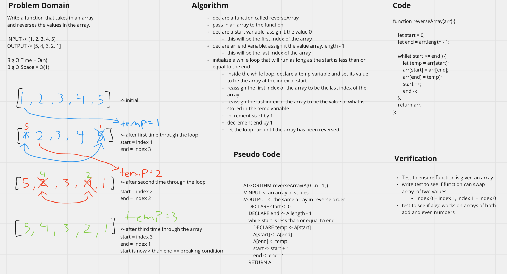

# Reverse an Array
<!-- Short summary or background information -->
Reverse an array.

## Challenge
<!-- Description of the challenge -->
Write a function called `reverseArray` which takes an array as an argument. Without utilizing any of the built-in methods available to your language, return an array with elements in reversed order.

## Approach & Efficiency
<!-- What approach did you take? Why? What is the Big O space/time for this approach? -->
The approach for this challenge was fairly straight forward. Assign pointers to the front and end of the array and swap the values inside a loop. At each pass of the loop, the front and end pointer will get one closer to the center. Once the end is greater than the front, stop the loop and return the array.
- Write a function that takes in an array.
- Declare a start variable that is set to 0, which is the first index of the array.
- Declare an end variable which is the array.length - 1, which will give the last index of the array.
- Use a while loop that runs so long as start is less than or equal to the end.
  - `while (start <= end )`
- Inside the while loop, declare a temp variable and set its value to be the array at the index of start, which would initally be 0.
  - `let temp = arr[start]`
- Reassign the first inde of the array to be the last index of the array.
  - `arr[start] = arr[end]`
- Reassign the last index of the array to be the value of what is stored in the temp variable.
  - `arr[end] = temp`
- Increment the start variable by 1.
- Decrement the end variable by 1. 

Big O:
- Time = O(n)
- Space = O(1)

## Solution
<!-- Embedded whiteboard image -->
