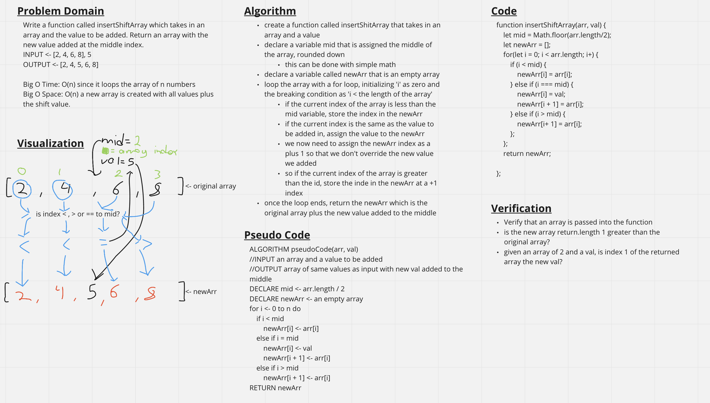

# Array Shift
<!-- Short summary or background information -->
Add a value to the middle of an array.

## Challenge Description
<!-- Description of the challenge -->
Write a function called insertShiftArray which takes in an array and the value to be added. Without utilizing any of the built-in methods available to your language, return an array with the new value added at the middle index.

## Approach & Efficiency
<!-- What approach did you take? Why? What is the Big O space/time for this approach? -->
The approach I took was to first find the middle of the array and store that value to a variable. That would be the target to look for in the array. I then declared a new, empty array. As I loop the original intake array, if the index is less than the middle, I store it to the new array. If the index matches the value to be added, then add the new value to the array. Then, if the index is greater than mid, then store it in the array one ahead of where it was in the original.

## Solution
<!-- Embedded whiteboard image -->
