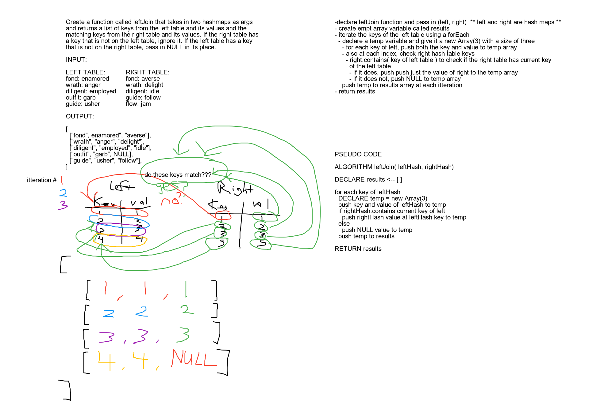

# Challenge Summary
<!-- Short summary or background information -->
Create a function called leftJoin that takes in two hash tables as arguments and returns a data structure containing the left table key value pairs and any values from the right table whose keys are also found in the left table.

## Challenge Description
<!-- Description of the challenge -->
This is a function that will take in two hash tables, a `left` table and a `right` table.

- The first parameter is a hashmap that has word strings as keys, and a synonym of the key as values.
- The second parameter is a hashmap that has word strings as keys, and antonyms of the key as values.
- Combine the key and corresponding values (if they exist) into a new data structure according to LEFT JOIN logic.
 - LEFT JOIN means all the values in the first hashmap are returned, and if values exist in the “right” hashmap, they are appended to the result row. If no values exist in the right hashmap, then some flavor of NULL should be appended to the result row.

## Approach & Efficiency
<!-- What approach did you take? Why? What is the Big O space/time for this approach? -->

Time complexity: O(n) - All of the keys of the left table will have to be traversed to store them first in the new data structure.
Space complexity: O(n) - The results data structure will have to contain as many values as there are keys in the left table.

## Solution
<!-- Embedded whiteboard image -->
Challenge 08 whiteboard part 1:
