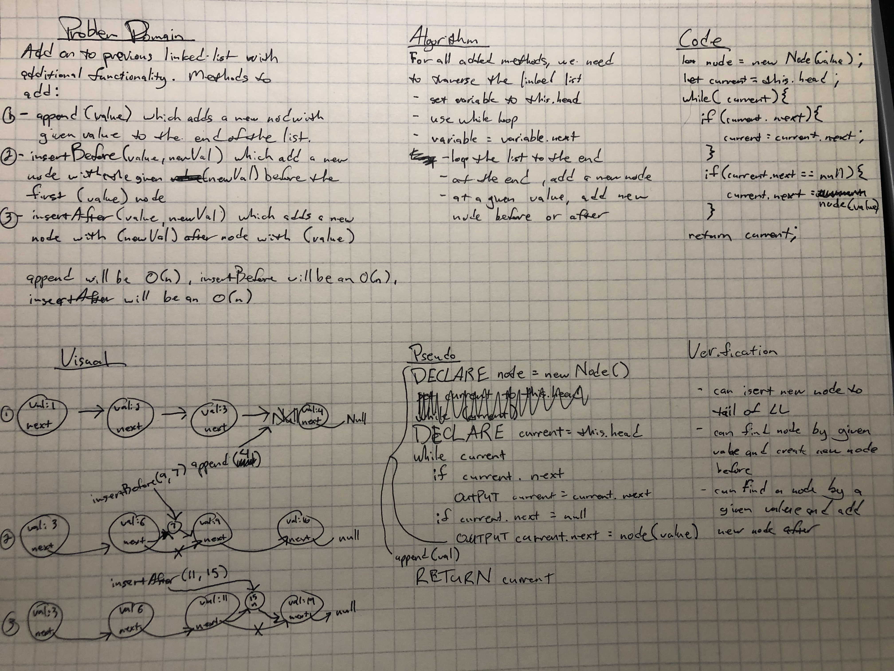

# Singly Linked List

Implementation of a singly linked list.

[Challenge 06 PR](https://github.com/penjoe/data-structures-and-algorithms/pull/27)

## Challenge

Create a linked list with methods to:
1. insert() - add a new node at the head of the list
2. includes() - search linked list and find a specified value, returning a boolean value whether or not the specified value is in the linked list
3. toString() - return a string of all the values in the linked list

Update: 
Added new methods for inserting nodes to the linked list:
1. append() - add a new node to the tail of the list
2. insertBefore - insert a new node before a specified node
3. insertAfter - insert a new node after a specified node

## Approach & Efficiency

The approach I took was the most direct one I could come up with. For the insert method, I wanted to simply create a new node and set the pointer of that node to the head and then set the pointer of the current head to the new node, effectively placing the new node at the head. This was an O(1) complexity.

For the includes and toString both, I needed to traverse the linked list to either find a specific value or to grab and concat all the values. Since this involved looping, I used a while loop with the breaking condition depending on the function. Since I had to iterate over the linked list, the `includes()` and `toString()` methods were both an O(1) complexity.

`insertBefore`, `insertAfter` and `append` are all an O(n) since they loop the entirety of the linked list.

All other methods will be a time complexity of O(n) since they all require the traversal of the list, whether partially or in its entirety.

## API

Public methods used in this linked list implementation:

`insert()` - This method takes in any value as an argument, creates a new node and adds that node to the head of the linked list.

`includes()` - This method takes in a value, searches the linked list for that value and returns a true or false value depending on whether or not the given value exists in the linked list.

`toString()` - This method takes in no argument. It will traverse the linked list and return a string containing all of the values concatenated together in the format `" { 1 } -> { 2 } > NULL "`.

`append()` - This method takes in a value as an argument, creates a new node and appends the node to the tail of the linked list.

`insertBefore()` - Takes in two arguments, a value to be searched for and a newValue to be added. It traverses the linked list, finds the value and inserts a new node with the given newValue before the node with the searched value.

`insertAfter()` - This method takes in two arguments, a value to be searched and a newValue to to added. It traverses the linked list, finds the given value and inserts a new node with the newValue after the node with the searched value.

`kthFromEnd()` - This method will take in a number, `k`, and return the value of the node that is `k` from the end of the list. To do this, the list is traversed up until a given value of `k`. Once the current node reaches this point, a new pointer is set to a variable called `second` that then follows the current node at a relatve distance. Meaning that second will never catch up to current. So once current reaches the end of the list, second will be pointing to the node with the desired value. This uses a time complexity of O(n) and a space complexity of O(1).

`nodeCounter()` - A simple method that tracks the total number of nodes that are in the linked list. 

## Solution

Solution for Code Challenge 06 - `ll-insertions`

Solution for Code Challenge 07 - `kthFromEnd`

