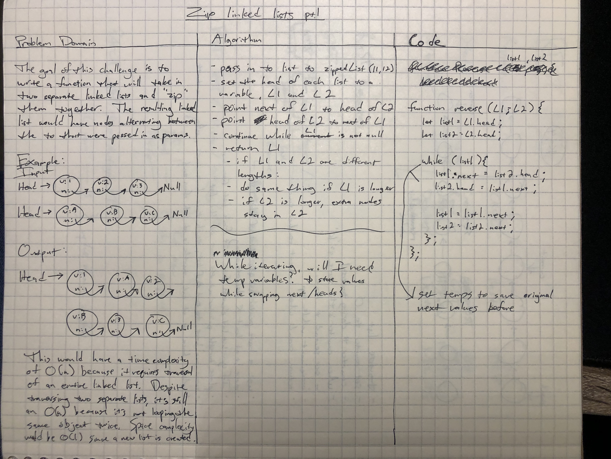
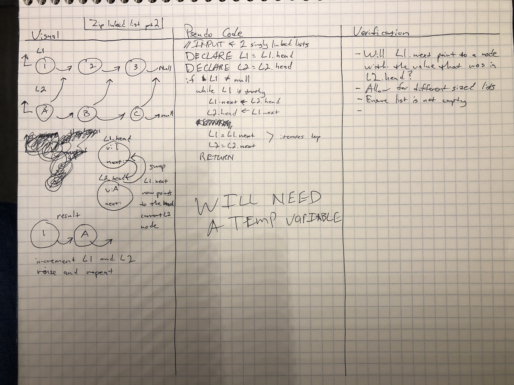

# Challenge Summary
<!-- Short summary or background information -->

#### 401 Code Challenge 08:

This challenge is to take two separate singly linked lists, "zip" them together and return the new list that contains all nodes of the two previous lists.

## Challenge Description
<!-- Description of the challenge -->
In this challenge, I will be creating a function called zipLists(). This function will take in two existing linked lists as parameters. The goal will be to zip the two lists together, much the same way a zipper on your jacket would work. The result should be one linked list that has all the nodes of the two linked lists that were passed in. The nodes should be alternating between the two original linked lists. Here's a visualization of what is expected:

Input:
```
list1 = head -> {1} -> {3} -> {5} -> NULL
list2 = head -> {2} -> {4} -> {6} -> NULL
```
Output:
```
zippedList = head -> {1} -> {2} -> {3} -> {4} -> {5} -> {6} -> NULL
 ```

## Approach & Efficiency
<!-- What approach did you take? Why? What is the Big O space/time for this approach? -->

For this challenge, the approach I took was trying to keep the moving parts simple. I wanted to avoid making a new linked list or creating some sort of an array to hold values. Instead, I approached it like I did some of the previous linked list challenges. Set the head of each list to a variable, L1 and L2. Point the head of L1 to next of L2 and then point the head of L2 to the next of L1. Basically, the is just telling the head node of the second list to now be whatever value comes next in the first list. There will need to be a temp variable created to save the original value of next so that I won't lose it when it is reassigned and not be able to increment the while loop. Then, as the loop increments, each node of the second list should effectively "zip" into the first list in front of the current node of list 1.

Time complexity: O(n) - linked lists are being fully traversed.
Space complexity: O(1) - no new data structure is being created. The first list is being modified in place. 

## Solution
<!-- Embedded whiteboard image -->
Challenge 08 whiteboard part 1:

Challenge 08 whiteboard part 2:
