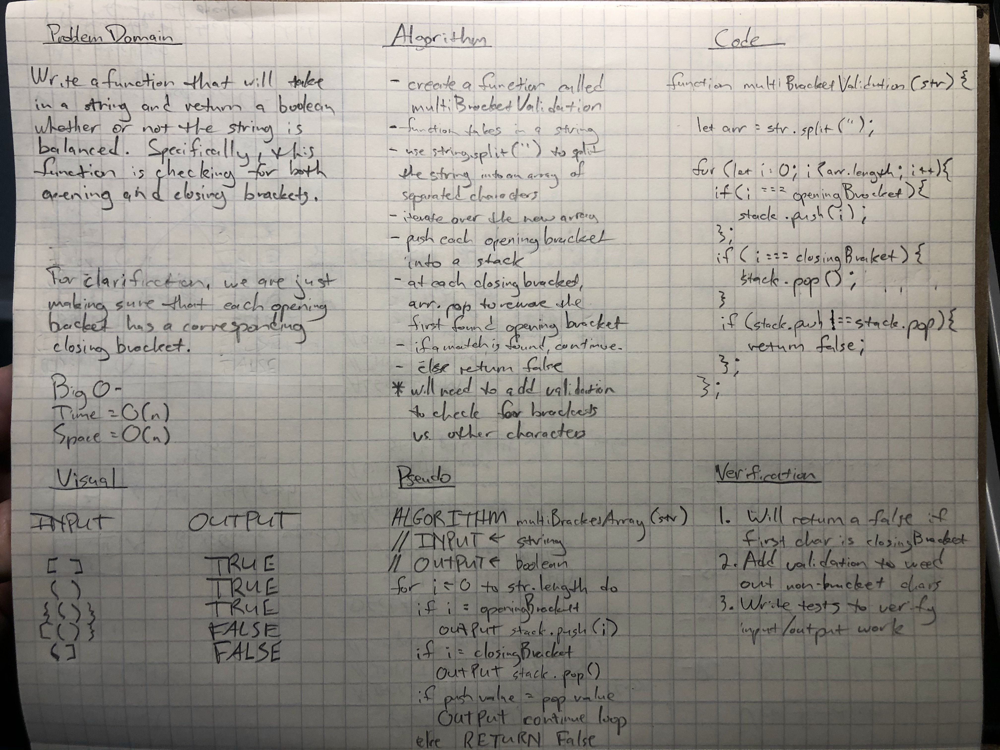

# Challenge Summary
<!-- Short summary or background information -->

Multi-Bracket Validation

## Challenge Description
<!-- Description of the challenge -->

Your function should take a string as its only argument, and should return a boolean representing whether or not the brackets in the string are balanced. There are 3 types of brackets:
- `Round ()`
- `Square []`
- `Curly {}`

## Approach & Efficiency
<!-- What approach did you take? Why? What is the Big O space/time for this approach? -->

For this challenge, the approach is to iterate over the string and push each opening bracket into a stack. At each closing bracket, pop from the top of the stack to create a matched pair of brackets. If the stack is empty when the string is looped through, that means there were no odd brackets. But if the stack is not empty after the loop, that means there was an opening bracket with no closing bracket. Also, if a if a pair is formed that is not matching, then return false. 

Time complexity: O(n)
Space complexity: O(n)

## Solution
<!-- Embedded whiteboard image -->

