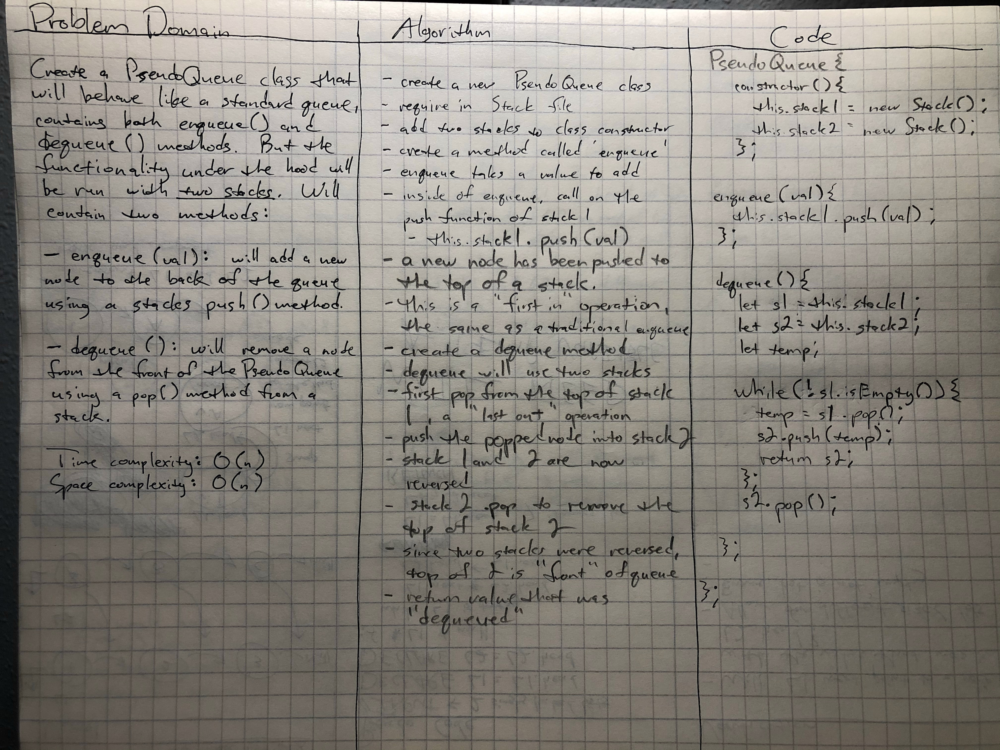

# Challenge Summary
<!-- Short summary or background information -->
## 401 Code Challenge 11: Queues with Stacks

This challenge is making a PseudoQueue, a class that has the same methods as a regular Queue, but the internal workings are all handled by two Stacks.

### Challenge Description
<!-- Description of the challenge -->

PseudoQueue is a class that has two methods, enqueue() and dequeue(), just as any Queue would normally have. Instead of these two methods working like normal, we are going to imitate the Queue function by utilizing two separate stacks and their push() and pop() methods. Enqueue() will use stack.push() and dequeue() will use stack.pop(). This will all be handled using linked lists as the storage of the stacks.

### Approach & Efficiency
<!-- What approach did you take? Why? What is the Big O space/time for this approach? -->

First, a queue functions as "first in, first out". For the `enqueue()` method, it will require the use of a stacks `pop()` method. In the class' constructor, initialize two new Stacks, stack1 and stack2. `Enqueue()` is the simpler of the two methods. Since a Stack's `push()` method is also a "first in" operation, running `stack1.push(val)` will add a new node to the top of the stack, or the "back" of the "queue". This only requires the use of one stack.

For the `dequeue()` method, we will need to utilize both stacks. Since a Stack's `pop()` method is a "last out" operation, by itself this would be removing a node from the "back" of the "queue". Since we have two stacks, we simply need to reverse their orders. As we `pop()` from stack1, we immediately `push()` into stack2. Then, if we were to `pop()` from stack2, even though it's a "last out" operation, the stacks have been reversed. So what was originally the "back" of the "queue" has now become the "front". So calling `stack2.pop()` will then become a "first out" operation.

Time Complexity: O(n) since we will have to run a while loop inside of `dequeue()` to ensure we continue to `pop()` until the Stack is empty.

Space Complexity: O(n) since we are creating two new Stacks that are (n) in length.

### Solution
<!-- Embedded whiteboard image -->

