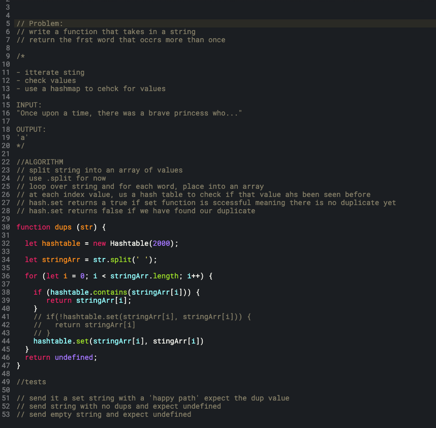

# Code Challenge 31: Repeated Word
Write a function that takes in a string and returns the first repeated word in the string.

## Challenge Description
<!-- Description of the challenge -->

## Approach & Efficiency
<!-- What approach did you take? Why? What is the Big O space/time for this approach? -->

## Solution
<!-- Embedded whiteboard image -->
