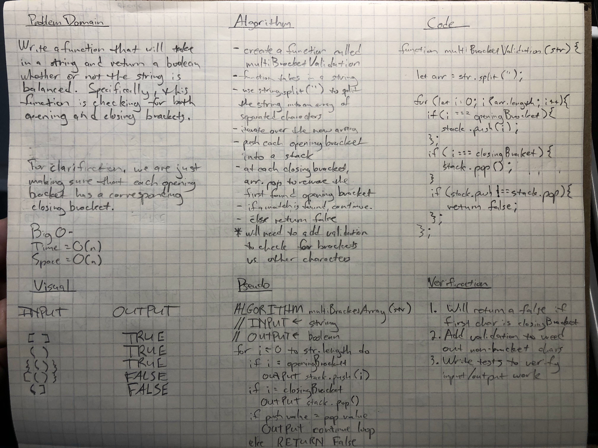

[Table of Contents](README.md)

# Challenge Summary

String validation.

[GitHub PR](https://github.com/penjoe/data-structures-and-algorithms/pull/35)

## Challenge Description

Write a function called `multiBracketValidation(input)` that takes only a string as an input. This function will return a boolean value indicating whether or not the string is balanced. Specifically, within the string there can be various brackets. This function checks to see whether or not each type of bracket has both an opening and a closing bracket. 

Examples:

- `()` -> TRUE
- `[]` -> TRUE
- `{()}` -> TRUE
- `(]` -> FALSE
- `{(])}` -> FALSE

## Approach & Efficiency

For this challenge, we are determining of a string has both opening and closing brackets and also that they are a valid pair. This is essentially imitating a basic linter for brackets. To do this, we will be utilizing a stack. First, loop over the string and check to see if each character is a closing or opening bracket. If the current index is an opening bracket, we will push this value to the stack. If the current index is a closing bracket, we will invoke the pop() method of our stack and compare the item that was ppoped to the current index. If done right, this should be checking to see if the current index, a closing bracket, is the same as the top of the stack, which should have been the last opening bracket. If they are a match, do nothing and move on. If they are not a match, return false and end the loop.

Here are the steps we take to get this done:

- create the function `multiBracketValidation(str)` that takes in a string
- use `str.split('')` to create an array containing all the characters of the string
- set variables for each type of closing and opening bracket for easier use
- check to see if the array is empty and return false if it is
- check to see if the first index is a closing bracket and return false if it is
- loop over the newly created array with a simple for loop
    - if the current index is an opening bracket, push that bracket to a stack
    - if the current index is a closing bracket, pop the top element off of the stack
        - if the current closing bracket and the popped opening bracket are the same, continue the loop
        - otherwise, return false and end the loop
- once the loop has gone to the end of the string, check to see if the stack is empty
    - if the stack is empty, return true since all brackets had their matching counterpart
    - if the stack is not empty, return false since not all brackets were a complete pair

BigO for this function:
Time: O(n) since we will have to loop over an array
Space: O(n) since we will be initializing a new stack for this function

## Solution

